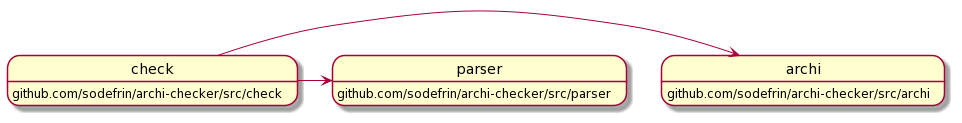

# archi-checker

archi-checker is dependency vaidation tool. 

## Install

```
go get -u github.com/sodefrin/archi-checker
```

## Usage

archi-chcker validates packages dependencies using UML definition.

For example, this is the dependency of this package.



```
archi: github.com/sodefrin/archi-checker/src/archi
check: github.com/sodefrin/archi-checker/src/check
parser: github.com/sodefrin/archi-checker/src/parser

check -> archi
check -> parser
```

We can validate this package using archi-checker command.

```
$ archi-checker -uml testdata/this_package.uml -module github.com/sodefrin/archi-checker src/archi src/check src/parser  
```

If the we change dependency like below to apply DIP, the error wil be repoted.


```
archi: github.com/sodefrin/archi-checker/src/archi
check: github.com/sodefrin/archi-checker/src/check
parser: github.com/sodefrin/archi-checker/src/parser

archi -> check
parser -> check
```

```
$ archi-checker -uml testdata/this_package_dip.uml -module github.com/sodefrin/archi-checker src/archi src/check src/parser  
$ src/check/check_test.go:7:2: cannot import github.com/sodefrin/archi-checker/src/archi from github.com/sodefrin/archi-checker/src/check
$ src/check/check_test.go:8:2: cannot import github.com/sodefrin/archi-checker/src/parser from github.com/sodefrin/archi-checker/src/check
$ src/check/check.go:4:2: cannot import github.com/sodefrin/archi-checker/src/archi from github.com/sodefrin/archi-checker/src/check
$ src/check/check.go:5:2: cannot import github.com/sodefrin/archi-checker/src/parser from github.com/sodefrin/archi-checker/src/check
```
